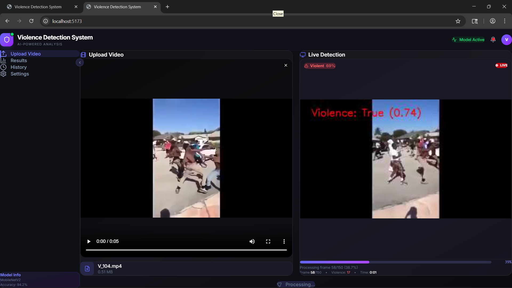
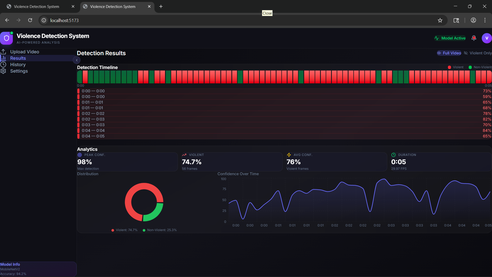
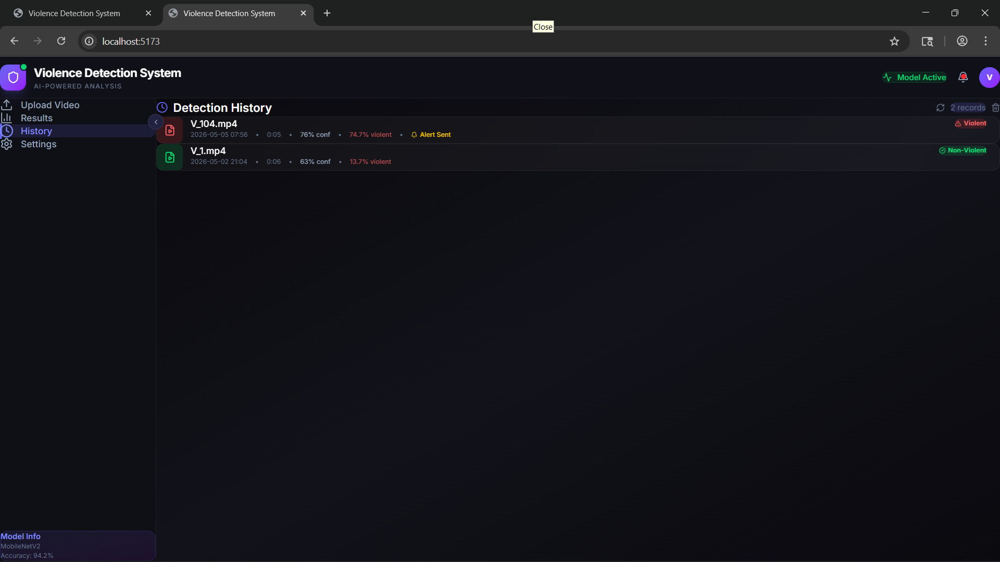
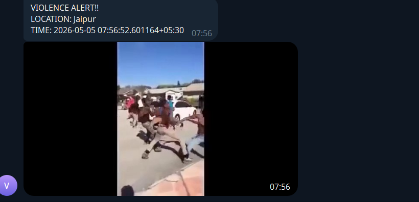

# Violence Alert System

A deep learning-based violence detection system that processes videos to detect violent activities in real-time. It uses a custom-trained MobileNetV2 model wrapped in a FastAPI backend and a React (Vite) frontend for an interactive dashboard. When violence is detected, it automatically sends an alert to a Telegram channel.

## Project Structure
- `backend/`: FastAPI backend server for video processing, streaming, and Telegram alerts.
- `web-ui/`: React + Vite based frontend dashboard.
- `model/`: Contains the pre-trained deep learning model (`modelnew.h5`).

## Features
- **Real-Time Detection**: Processes videos frame-by-frame and streams results to the UI via WebSocket.
- **Deep Learning Model**: Utilizes a MobileNetV2 architecture fine-tuned for violence detection.
- **Telegram Alerts**: Instantly sends a photo and location-based alert to a Telegram channel upon detecting violence.
- **History Tracking**: Keeps a log of past detections with video summaries, confidence levels, and processed outputs.

## Screenshots
*(Note: High-resolution versions of these images can be found in the `assets/` directory).*

### 1. Live Detection Dashboard


### 2. Detection Results & Analytics


### 3. Detection History


### 4. Telegram Alert


## Prerequisites
- Python 3.8+
- Node.js (for frontend)
- Git

## Installation & Setup

### 1. Clone the repository
```bash
git clone https://github.com/jainjalajj/Violence_Alert_System.git
cd Violence_Alert_System
```

### 2. Backend Setup
```bash
# Recommended: Create a virtual environment
python -m venv .venv
# On Windows:
.venv\Scripts\activate
# On Mac/Linux:
source .venv/bin/activate

# Install dependencies
pip install fastapi uvicorn opencv-python numpy tensorflow telepot pytz python-multipart websockets
```

### 3. Frontend Setup
```bash
cd web-ui

# Install dependencies
npm install
```

## Running the Application

1. **Start the Backend Server**
```bash
# From the root directory, run the server
python backend/server.py
```
The FastAPI backend will start running on `http://localhost:8000`.

2. **Start the Frontend UI**
```bash
# In a new terminal, navigate to web-ui
cd web-ui
npm run dev
```
The React frontend will start running on `http://localhost:5173` (or the port specified by Vite).

## Configuration
- Telegram alerts are configured in `backend/server.py`. To enable alerts for your own channel, replace the `TELEGRAM_BOT_TOKEN` and `TELEGRAM_CHAT_ID` variables with your own credentials.

## Dataset / Testing
To test the detection system, you can use the **[Real Life Violence Situations Dataset](https://www.kaggle.com/datasets/mohamedmustafa/real-life-violence-situations-dataset)** available on Kaggle. It contains hundreds of real-world video clips of both violent and non-violent situations that work perfectly as input data for the UI.

## Jupyter Notebooks
If you want to view the raw model training, testing, or standalone script formats, you can find the original Jupyter Notebooks (`violence_pred.ipynb` and `mobilenetv2_model.ipynb`) in the root of the repository.
